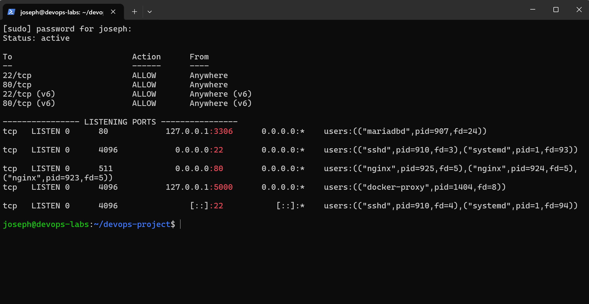
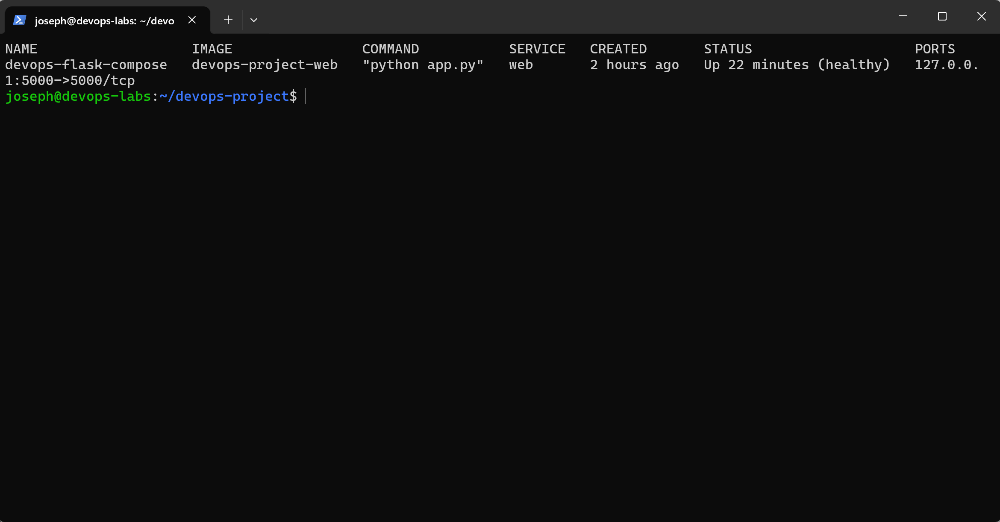
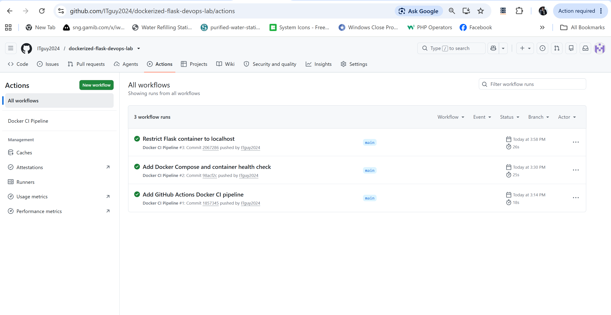

# Ubuntu DevOps Infrastructure Lab

A hands-on DevOps portfolio project demonstrating the deployment, security hardening, monitoring, and automated testing of a containerized Flask web application on Ubuntu Server.

The project uses Docker, Docker Compose, Nginx, UFW, MariaDB, Git, and GitHub Actions to create a small but practical Linux infrastructure environment.

## Architecture

```text
Client
  |
  v
UFW Firewall
  |
  v
Nginx :80
  |
  v
127.0.0.1:5000
  |
  v
Docker Container
  |
  v
Flask Application

MariaDB
127.0.0.1:3306
```

Nginx acts as the public-facing reverse proxy while the Flask application and MariaDB are restricted to localhost.

## Technologies Used

- Ubuntu Server 24.04 LTS
- Docker
- Docker Compose
- Python / Flask
- Nginx
- UFW Firewall
- MariaDB
- Git
- GitHub
- GitHub Actions

## Key Features

### Dockerized Flask Application

The Flask application runs inside a Docker container and provides:

- Web application endpoint
- `/health` health-check endpoint
- Docker container health monitoring
- Docker Compose service management

Example health response:

```json
{"status":"healthy"}
```

### Nginx Reverse Proxy

Nginx listens on port `80` and forwards requests to the Flask application running on:

```text
127.0.0.1:5000
```

The Flask container is not published on all network interfaces.

### Firewall Hardening

UFW is enabled with only the required inbound services allowed:

```text
22/tcp - SSH
80/tcp - HTTP
```

Application port `5000` and database port `3306` are not opened through UFW.

### MariaDB Security

MariaDB is bound to:

```text
127.0.0.1:3306
```

This prevents the database service from being directly exposed to the network.

A dedicated application database and database user were created instead of using the MariaDB root account.

The application database user is restricted to:

```text
devops_user@localhost
```

and its privileges are scoped to the application database.

> Database passwords and other credentials are intentionally not stored in this repository.

### Docker Health Check

Docker Compose continuously checks the Flask health endpoint:

```text
http://localhost:5000/health
```

Container status can be verified with:

```bash
docker compose ps
```

### CI Pipeline

GitHub Actions automatically validates the project whenever changes are pushed to the `main` branch.

The CI workflow:

1. Checks out the repository
2. Builds the Docker image
3. Starts the container
4. Waits for the application
5. Tests the `/health` endpoint
6. Confirms the container is running

This provides automated validation that new changes do not break the Dockerized application.

## Security Approach

The project follows several basic infrastructure security principles:

- Minimize publicly exposed services
- Use Nginx as the application entry point
- Restrict Flask to localhost
- Restrict MariaDB to localhost
- Enable host firewall rules
- Keep SSH access explicitly allowed
- Avoid using database root credentials for applications
- Validate configurations before reloading services
- Verify application health after infrastructure changes
- Keep application configuration under version control

### Server Security Verification

UFW limits inbound access to the required services, while the Flask application and MariaDB are bound to localhost.



## Verification

### Docker Container Health

The Docker Compose service includes an automated health check to verify application availability.



### Check running containers

```bash
docker compose ps
```

### Check application directly

```bash
curl http://127.0.0.1:5000/health
```

### Check application through Nginx

```bash
curl http://localhost/health
```

### Validate Nginx

```bash
sudo nginx -t
```

### Check firewall

```bash
sudo ufw status verbose
```

### Inspect listening ports

```bash
sudo ss -tulpn
```

### Verify MariaDB network binding

```bash
sudo ss -tulpn | grep 3306
```

## Change Validation and Rollback

Infrastructure changes are applied incrementally and verified immediately afterward.

Before reloading Nginx:

```bash
sudo nginx -t
```

After application or infrastructure changes:

```bash
docker compose ps
curl http://localhost/health
```

Git provides configuration history so previous known-good application configurations can be identified and restored if necessary.

```bash
git log --oneline
```

## Running the Application

Build and start the application:

```bash
docker compose up -d --build
```

Check its status:

```bash
docker compose ps
```

Test through Nginx:

```bash
curl http://localhost/health
```

Stop the application:

```bash
docker compose down
```

## CI/CD

The GitHub Actions workflow is located at:

```text
.github/workflows/ci.yml
```

Each push to `main` automatically triggers the Docker build and application health test.

### GitHub Actions Pipeline

The CI pipeline automatically builds and tests the Dockerized application after changes are pushed to the main branch.



## Project Structure

```text
devops-project/
├── .github/
│   └── workflows/
│       └── ci.yml
├── .dockerignore
├── .gitignore
├── Dockerfile
├── docker-compose.yml
├── app.py
├── requirements.txt
└── README.md
```

## Demo

A recorded demonstration of the infrastructure covers:

- Dockerized Flask deployment
- Nginx reverse proxy configuration
- Listening-port verification
- UFW firewall hardening
- MariaDB network and account restrictions
- Application health verification
- Rollback approach

Demo video: Coming soon

## What I Learned

This project strengthened my practical understanding of Linux server administration and DevOps workflows, particularly around service exposure, reverse proxies, firewall configuration, database access control, Docker networking, health monitoring, Git-based change management, and automated CI testing.

It also reinforced an important operational principle: infrastructure changes should be understood before execution, applied incrementally, verified immediately, and accompanied by a clear rollback path.

## Author

Joseph Nicolas

DevOps / IT Infrastructure / Automation

Portfolio: https://itguy2024.github.io/portfolio/
